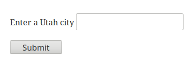

# Lab2: Calling APIs with JQuery

In this assignment you will use JQuery to call APIs for the weather and for Stack Overflow
questions.

## Weather API

In `index.html`, build a form that includes a text input and a submit button:

Then, in `scripts.js` do the following:

Create a JavaScript event handler that triggers when the Submit
button is clicked. Inside this handler, use the value of the input
field to send a request to the [OpenWeatherMap
API](https://openweathermap.org/api) to get the current weather for
that city. See
[hints](https://github.com/BYU-CS260-Winter-2018/lab2/wiki/Weather-API)
for helpful information.

## Stack Overflow

In `index.html`, build a form that includes a text input and a submit
button, similar to the one for weather, but instead for querying Stack
Overflow.  Then, in `scripts.js` do the following:

Create a JavaScript event handler that triggers when the Submit
button is clicked. Inside this handler, use the value of the input
field to send a request to the <a
href="https://api.stackexchange.com/2.2/search?order=desc&sort=activity&site=stackoverflow&intitle=javascript">Stack
Overflow API</a> to get a list of matching questions. Click the link
above to see an example of searching for `JavaScript`.  You can view
the [API documentation](https://api.stackexchange.com/docs/search) for
guidance. You can also use console output to inspect the returned JSON
from this API, like we show in the Wiki, and figure out the format
from there. **This part you will do on your own.**

## Submission

Submit the URL for your website, which should be running on your DigitalOcean server.

## Rubric for Grading

When we grade these labs, we will award points using the following
rubric:

Item | Points
--- | ---
Correctly suggests cities based on the input value | 30
Search for current weather works | 30
Search on Stack Overflow works | 30
Uses good web design principles | 10

For the web design principles, you will receive 2 points for each for
**spacing**, **typography**, **color**, **consistency**, and
**responsive design**. We will subtract 1 point for a principle if you
need some work, 2 points if you need a lot of work.
